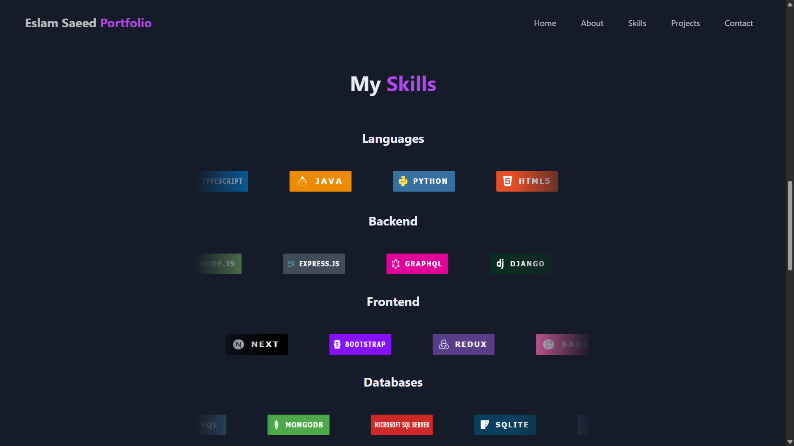

# Portfolio



A modern, responsive portfolio web app built with React and Vite. Showcases your skills, projects, and contact information with a beautiful UI and smooth user experience.

## Features
- Auto-scrolling skills section
- Responsive design for all devices
- Smooth navigation and section transitions
- Project cards with preview and GitHub links
- Contact section with clickable email and phone
- Easy deployment to Vercel

## Getting Started

1. **Install dependencies:**
	```bash
	npm install
	```
2. **Run locally:**
	```bash
	npm run dev
	```
3. **Build for production:**
	```bash
	npm run build
	```
4. **Deploy:**
	- Push to GitHub and connect to Vercel for instant deployment.

## Project Structure
```
public/
  portfolio.png         # Main portfolio screenshot
  ...other icons/images
src/
  components/          # React components
  assets/              # Optional local assets
  App.jsx              # Main app
  index.css            # Global styles
  main.jsx             # Entry point
```

## Customization
- Update your skills, projects, and contact info in `data.js`.
- Add your own images/icons to the `public` folder and reference them with `/filename.png`.

## License
MIT